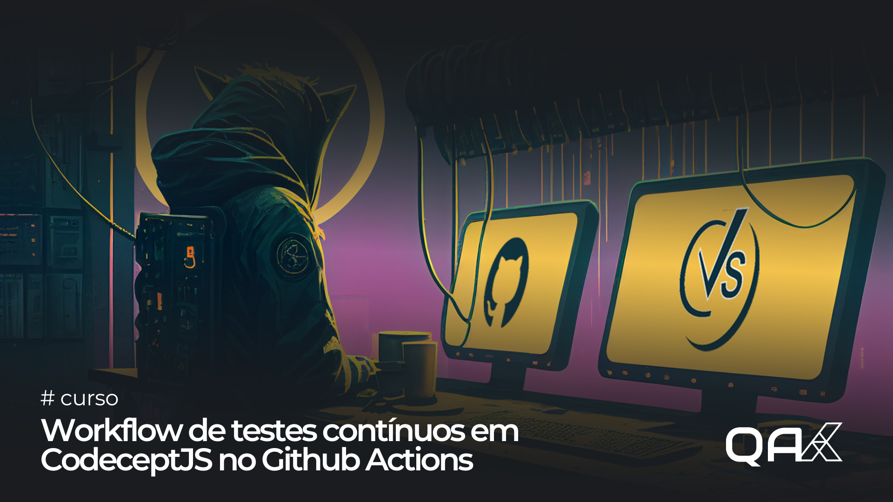

## Sobre

Repositório do treinamento: Workflow de testes contínuos em CodeceptJS no Github Actions

## Stacks
- CodeceptJS
- Javascript
- Playwright

## Rodando

1. Clonar o repositório, instalar as dependências
```
npm install
```

2. Executar testes em Headless
```
npx codeceptjs run --reporter mochawesome 
```

<hr>
Curso disponível em https://qaxperience.com

